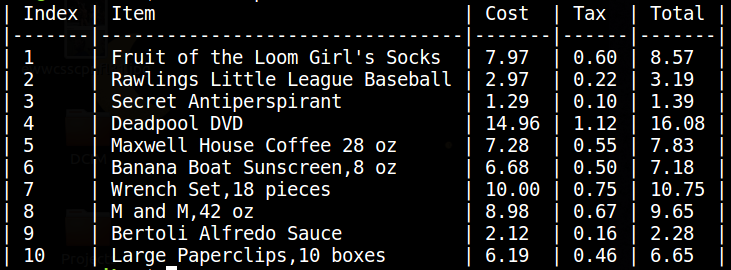
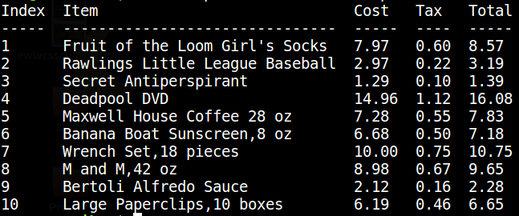

# tbl - `cat` for csv files

`tbl` lets you print out csv files to your terminal, formatted and "prettified".  

A lot of the hard work is done with the [rapidtables](https://github.com/alttch/rapidtables) package, check it out!

cat             |  tbl
-------------------------|-------------------------
  |  

Check out this recorded example:
[](https://asciinema.org/a/268740)
## Requirements
* Python 3.4+

## Installation
```shell
pip install --user tbl
```

## Usage options
Use ```tbl -h / tbl --help``` to see help.

* The most common use it to just print the table
```shell
tbl file.csv
```
* `--headers`  
The headers options lets you explicitly specify the headers for the table. Use this option when you csv files does 
not include headers, (e.g [exampleFile](example_csv/no_headers.csv)
```shell
tbl file.csv --headers '#Index#Item#Cost#Tax#Total'
```
* `--select`  
The select options lets you select what columns to print (similar to SQL SELECT)
```shell
tbl file.csv --select '#Item#Tax'
```  
:exclamation: Both `headers` and `select` use the first charcter as a separator, 
it can be any character (kinda like a `sed` expressions)  
:exclamation: The headers specified with this option are case-sensitive  
:star2: The `headers` and `select` headers can be used together

* `--format` (defualt: rstgrid)  
The format options lets you specify the format used when printing the table.  
The available formats are:

| rstgrid | rst | md | simple |
|-------|-------|-----------|-------|
|||||

## Restrictions
There are several cases `tbl` does not support:
* Duplicated headers, all headers must be distinct
* Very long headers, while tbl can wrap long paragraph of text in a cell, 
it cannot wrap text in the headers, which may lead to disfigured output

:exclamation: This is not the use case for tbl anyway, but dont try to print huge tables (several GBs), 
as tbl (and rapidtable) read the entire table to memory before printing

\* Example csv were downloaded from [here](https://people.sc.fsu.edu/~jburkardt/data/csv/csv.html)